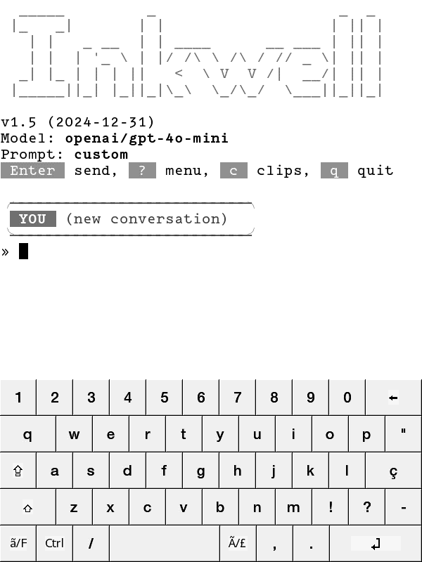
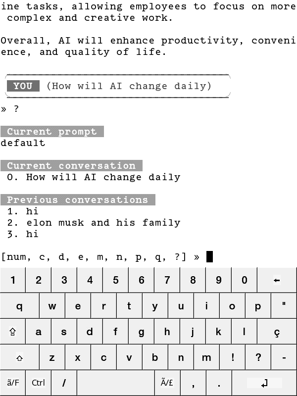
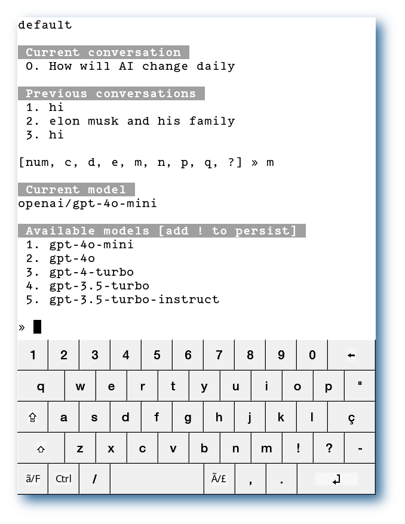
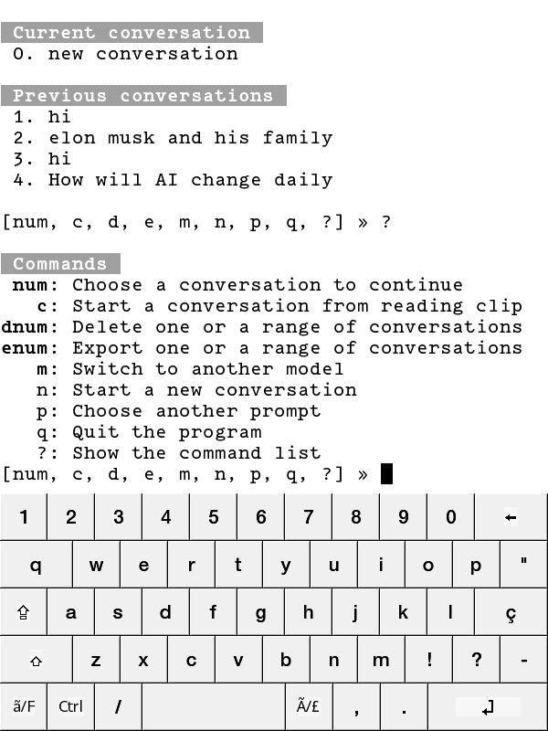

__English__ · [简体中文](readme_zh.md)

---

# Introduction  
**Inkwell** is a terminal-based AI assistant primarily designed for Kindle but also compatible with other terminal systems.  

1. **Python >= 3.8**  
2. Single-file design, no third-party library dependencies.  
3. Displays formatted Markdown text in the terminal.  
4. Summarizes and enables interactive Q&A with Kindle **My Clippings** (reading highlights and notes).  
5. Exports conversation history as well-formatted eBooks or sends them via email.  
6. Supports multiple AI providers: OpenAI, Google, xAI, Anthropic, Mistral, Groq, Perplexity, Alibaba.  
7. Automatically switch between multiple API keys.  
8. Automatically switch between multiple API servers.  


**Screen shots**       
    
    
    


# Installation  
1. Ensure your Kindle is jailbroken and has **KUAL** and [Python3](https://www.mobileread.com/forums/showthread.php?t=225030) installed.  
2. Extract `inkwell.zip` to the Kindle’s root directory (`/mnt/us`).  

# Configuration  
There are two ways to configure Inkwell:  
1. Open the `config.json` file in the Inkwell directory on your computer, edit the fields, and copy it back to your Kindle.  
2. Select `Inkwell Setup` from the **KUAL menu** and follow the wizard. Simply press Enter for any unclear steps.  

### Configuration Options  
- **provider**: AI provider. Supported values: `openai/google/xai/anthropic/mistral/groq/perplexity/alibaba`.  
- **model**: The model provided by the chosen AI service.  
- **api_key**: API keys (multiple keys separated by semicolons).  
- **api_host**: Third-party API server addresses (separated by semicolons).  
- **display_style**: Text display mode. Options:  
  - `markdown`: Formatted Markdown text.  
  - `markdown_table`: Formatted Markdown with table support.  
  - `plaintext`: Plain text.  
- **chat_type**: Chat session mode.  
  - `multi_turn`: Standard multi-turn conversation.  
  - `single_turn`: Simulated multi-turn for APIs that don’t support stateful sessions.  
- **token_limit**: Context token limit (keep reasonable).  
- **max_history**: Maximum number of saved conversation histories (conversation length is unlimited).  
- **prompt**: System prompt for conversations. Options:  
  - `default/custom`: Special values.  
  - Others refer to names in `prompts.txt`.  
- **custom_prompt**: Used when `prompt="custom"`.  
- **smtp_sender**: Optional, email sender address.  
- **smtp_host**: Optional, SMTP server and port (e.g., `smtp.gmail.com:587`).  
- **smtp_username**: Optional, SMTP username.  
- **smtp_password**: Optional, SMTP password.  


# Usage   
1. Click the KUAL menu item to enter. There is no need to enable Wi-Fi in advance; the script will automatically turn Wi-Fi on and off when exiting.   
2. Clicking a menu item labeled with `Clippings` allows you to immediately select book highlights for AI interaction.    
3. Supports sending multiple lines of text. Enter an empty line to trigger sending.   
4. Enter `?` at any time to open the menu, and `q` to exit.   


# Additional Features  

## AI-Assisted Q&A with Reading Highlights  
You can send selected reading highlights to the AI for further exploration, gaining deeper insights or understanding.   
### Access options:  
1. Use the `--clippings` startup argument.  
2. Enter `c` in the main interface.  
3. Enter `c` in the menu.  

## Exporting Conversations  
As **kterm** has limited scrollback and poor long-dialogue handling, Inkwell can export conversations as eBooks for better navigation and readability. Exported eBooks automatically appear in the Kindle library and can be emailed if SMTP settings are configured.  

Example commands:  
```  
e0: Export current conversation.  
e1: Export the first history conversation.  
e1-3: Export conversations 1 to 3.  
e1,3-5: Export conversations 1, 3, 4, and 5.  
```  

## Menu Command Overview  
- **`0`**: Return to the current conversation.  
- **`1` or higher**: Switch to a specific history conversation and continue chatting.  
- **`c`**: Open **clippings** for AI-assisted Q&A.  
- **`d`**: Delete one or multiple history conversations (e.g., `d0`, `d1-3`).  
- **`e`**: Export one or multiple history conversations (e.g., `e0`, `e1-3`).  
- **`m`**: Temporarily switch models (add `!` to save to configuration).  
- **`n`**: Start a new conversation.  
- **`p`**: Switch prompts (refer to custom prompt section).  
- **`q`**: Exit.  
- **`?`**: Show command help.  

## Custom Prompts  
Inkwell supports easy switching between prompts:  
1. Enter a custom prompt during configuration.  
2. Edit `custom_prompt` in the configuration file and set `prompt` to `custom`.  
3. Add prompts to `prompts.txt` in the Inkwell directory. Example format:  
   ```  
   prompt_name  
   content line1  
   content line2  
   ...  
   </>  
   another_prompt_name  
   content line1  
   ...  
   </>  
   ```  

# Additional Information  
1. Inkwell runs on **kterm**. Basic kterm operations include two-finger taps for the menu, font scaling, keyboard toggling, and screen rotation.  
2. For custom keyboard layouts, use the [kterm keyboard designer](https://github.com/cdhigh/kterm_kb_layouter).  
